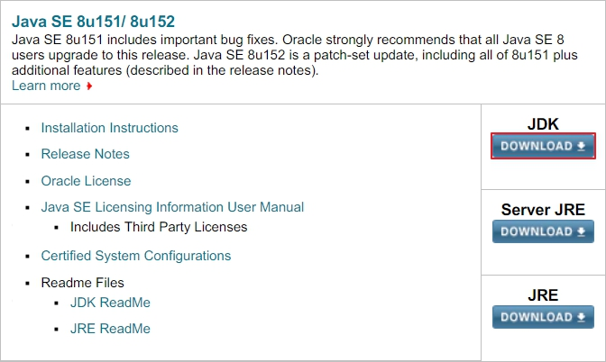
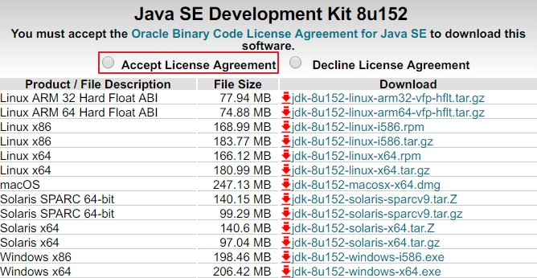
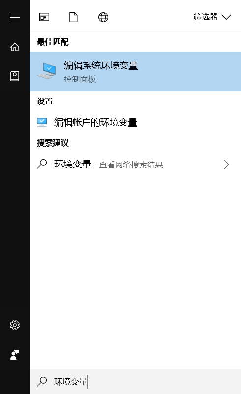
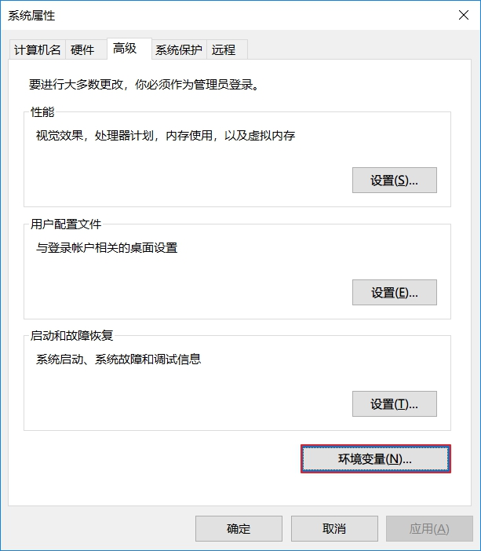
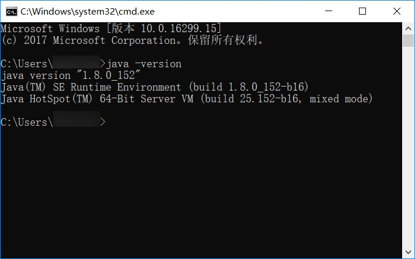
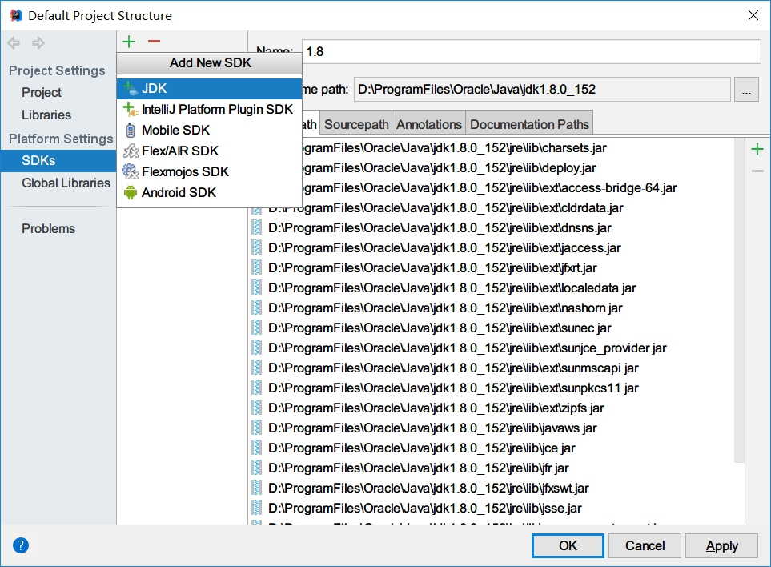
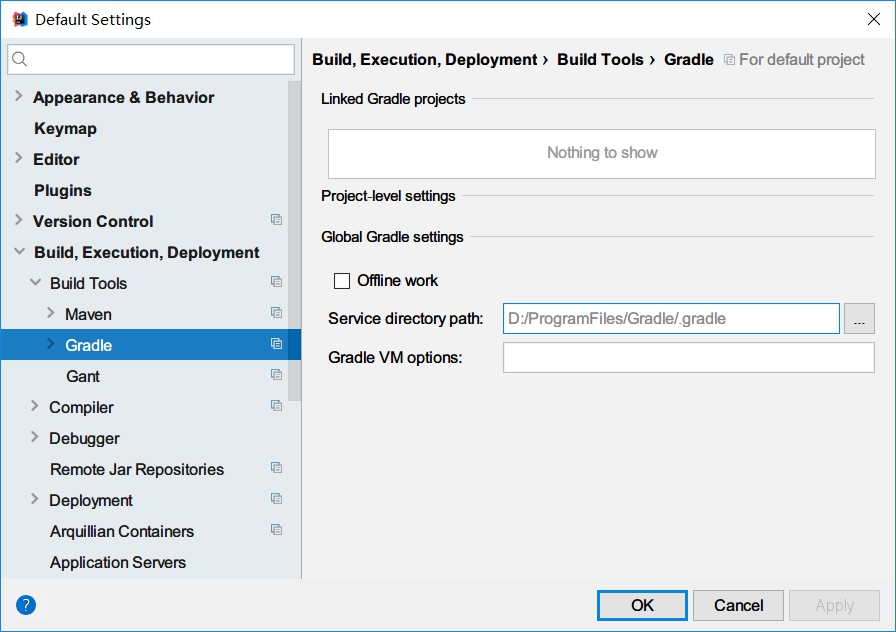

# 序

## 1. 课程介绍

这套教程讲的是基于 Spring Boot + Spring MVC + MyBatis Plus 架构，实现一个完整的前后端企业级博客系统。

### 1.1 技术选型

#### **后端技术**

| 技术             | 内容                             |
| ---------------- | -------------------------------- |
| Spring Framework | 容器                             |
| Spring Boot      | 简化 Spring 应用的搭建及开发过程 |
| Spring MVC       | MVC 框架                         |
| Spring Security  | 安全框架                         |
| MyBatis Plus     | ORM 框架 MyBatis 增强工具包      |
| Thymeleaf        | 模板引擎                         |
| ElasticSearch    | 全文搜索引擎                     |
| Gradle           | 项目构建管理                     |

#### **前端技术**

| 技术      | 内容     |
| --------- | -------- |
| jQuery    | 函式库   |
| Bootstrap | 前端框架 |

### 1.2 代码获取

[java-blog-sys-tutorial-code](//github.com/duanluan/java-blog-sys-tutorial)

### 1.3 一些说明

本教程因为是实战教程，所以不会详细讲解某个知识点，而是直接教你怎么做，本教程会尽力考虑到操作中的可能会出现的所有情况，并且会在一些内容第一次出现时给予说明，希望你能举一反三。

## 2. 开发准备

### 2.1 JDK（Java SE Development Kit）

打开 [Java SE 下载页面](//oracle.com/technetwork/java/javase/downloads/index.html)，找到并打开 [Java SE 8 JDK 下载页面](//oracle.com/technetwork/java/javase/downloads/jdk8-downloads-2133151.html)，选中 “Accept License Agreement” 同意协议并选择对应版本下载：





#### **Windows**

下载 Windows x86（32 位）或 Windows x64 后的 exe 文件，下载完成后打开并按照提示完成安装，期间会弹出安装 JRE（Java Runtime Environment）的窗口，不安装关闭即可，因为安装后的 JDK 目录下自带了 JRE。

按下 Windows 键（以后简称 Win 键），直接输入`环境变量`（Win7 也可以），选择“编辑系统环境变量”，在“系统属性”窗口右下角点击“环境变量”按钮。





在打开的“环境变量”窗口的系统变量中操作：

* 新建，变量名为 `JAVA_HOME`，值为你安装的 JDK 目录，我的是 `D:\ProgramFiles\Oracle\Java\jdk1.8.0_152`
* 新建，变量名为 `CLASSPATH`，值为 `.;%JAVA_HOME%\lib;%JAVA_HOME%\lib\tools.jar`
* Path 变量的值追加 `%JAVA_HOME%\bin;%JAVA_HOME%\jre\bin;`，Win10 要先点击“编辑文本按钮”再输入，Path 变量的最后没有分号需要先加上

点击“确定”按钮。

按下 Win 键，输入`cmd`打开命令提示符，输入`java -version`来查看 Java 版本，出现图示内容则表示环境变量配置成功。



#### **Linux**

下载 Linux x86 或 Linux x64 后的 .tar.gz 文件，我下载在了 `~/下载`目录。

打开终端进行操作：

```bash
# 创建 Java 目录（-p 为递归创建）
$ sudo mkdir -p /opt/oracle/java

# 将 JDK 解压到 Java 目录（-C 为指定解压目录）
$ sudo tar -zxvf ~/下载/jdk-8u152-linux-x64.tar.gz -C /opt/oracle/java

# 修改所有用户的环境变量（当前用户修改 ~/.bashrc 文件，Vim 自行安装）
$ sudo vim /etc/profile

# 在文件末尾新行 Shift + Insert 添加，其中 JAVA_HOME 是你的 JDK 目录
export JAVA_HOME=/opt/oracle/java/jdk1.8.0_152
export CLASSPATH=.:$JAVA_HOME/lib/dt.jar:$JAVA_HOME/lib/tools.jar
export PATH=$JAVA_HOME/bin:$JAVA_HOME/jre/bin:$PATH

# 在当前终端读取并执行 /etc/profile 中的命令，注销/重启计算机后完全生效
$ source /etc/profile

# 查看是否配置成功
$ java -version
java version "1.8.0_152"
Java(TM) SE Runtime Environment (build 1.8.0_152-b16)
Java HotSpot(TM) 64-Bit Server VM (build 25.152-b16, mixed mode)
```

### 2.2 Gradle Build Tool

打开 [Gradle | Installation](//gradle.org/install/)，找到 “Install manually” 进行手动安装，具体过程略，里面有详细的讲解。

#### 2.2.1 环境变量

不过它的第三步是直接将 Gradle 路径追加到了 PATH 中，这里推荐新建一个变量，我的写法是：

* Windows 下新建变量 `GRADLE_HOME`，值为 Gradle 路径，我的是 `D:\ProgramFiles\Gradle`，然后 Path 变量后追加 `%GRADLE_HOME%\gradle-4.4.1\bin;`
* Linux 下在 /etc/profile 文件末尾新行追加：
  ```bash
  export GRADLE_HOME=/opt/gradle
  export PATH=$GRADLE_HOME/gradle-4.4.1/bin:$PATH
  ```

#### 2.2.2 配置本地仓库

首先需要修改本地仓库位置，有多种方法，这里采用修改环境变量的方式，新建变量 `GRADLE_USER_HOME`，我的值为 `%GRADLE_HOME%\.gradle` 和 `$GRADLE_HOME/.gradle`。

然后还需要修改仓库地址为阿里云镜像，也有多种方法，这里采用在 .gradle 内创建 init.gradle 的方式，内容为：
```
allprojects {
    repositories {
         maven {
             name "aliyun"
             url "http://maven.aliyun.com/nexus/content/groups/public/"
         }
    }
}
```

### 2.3 IntelliJ IDEA（The Java IDE for Professional Developers by JetBrains）

打开 [IntelliJ IDEA 下载页面](//jetbrains.com/idea/download)，会自动识别当前计算机系统，也可以自行选择。这里有两个版本的 IDEA，我们下载 Ultimate 版本。

安装和使用可以参考 [IntelliJ IDEA 简体中文专题教程](//github.com/judasn/IntelliJ-IDEA-Tutorial)，参与作者汇总当中可以找到我（虽然我只改了一点），激活请[百度](//baidu.com/s?wd=idea%20license%20server)。

#### 2.3.1 配置 JDK

打开 IDEA，按下 `Ctrl + Alt + Shift + S` 打开 Default Project Structure，新增一个 SDK，如果配置了 JAVA_HOME，这一步其实可以忽略。



#### 2.3.2 配置 Gradle

按下 `Ctrl + Alt + S` 打开 Default Settings，其中 “Service directory path” 默认会是 GRADLE_USER_HOME 环境变量，如果不是的话，手动设置一下。


