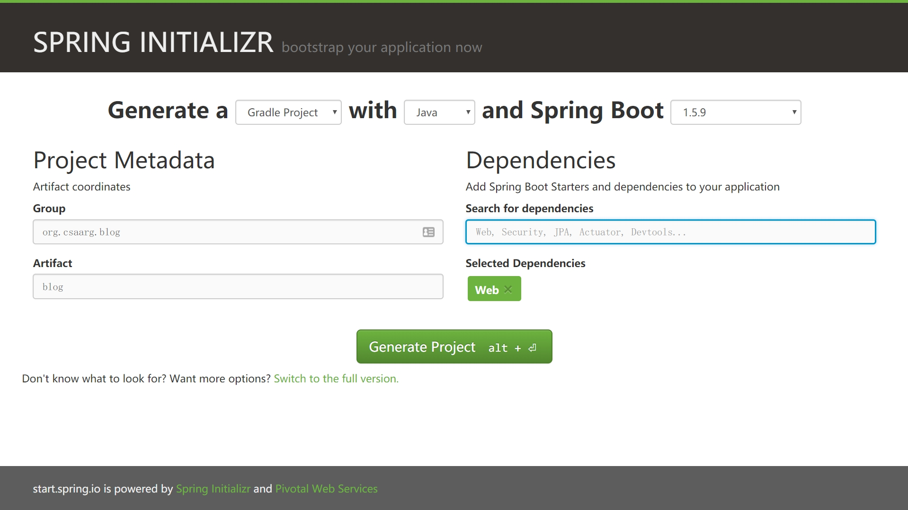

# Spring Boot

Spring Boot 可以不使用 XML 配置快速搭建和开发 Spring 应用。

## 1. 使用 Spring Initializr 初始化 Web 项目

打开 [start.spring.io](http://start.spring.io/)，生成一个 Gradle Project，除了填写 Group 和 Artifact 之外，还需要在 Dependencies 当中添加 Web（Full-stack web development with Tomcat and Spring MVC）：

我们把下载下来的项目解压出来并把文件名 demo 改为 blog，然后用 IDEA 打开。

