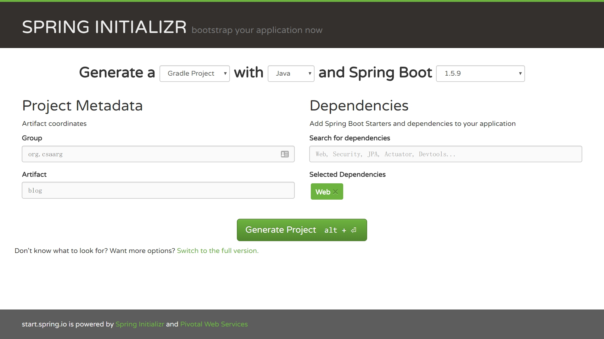
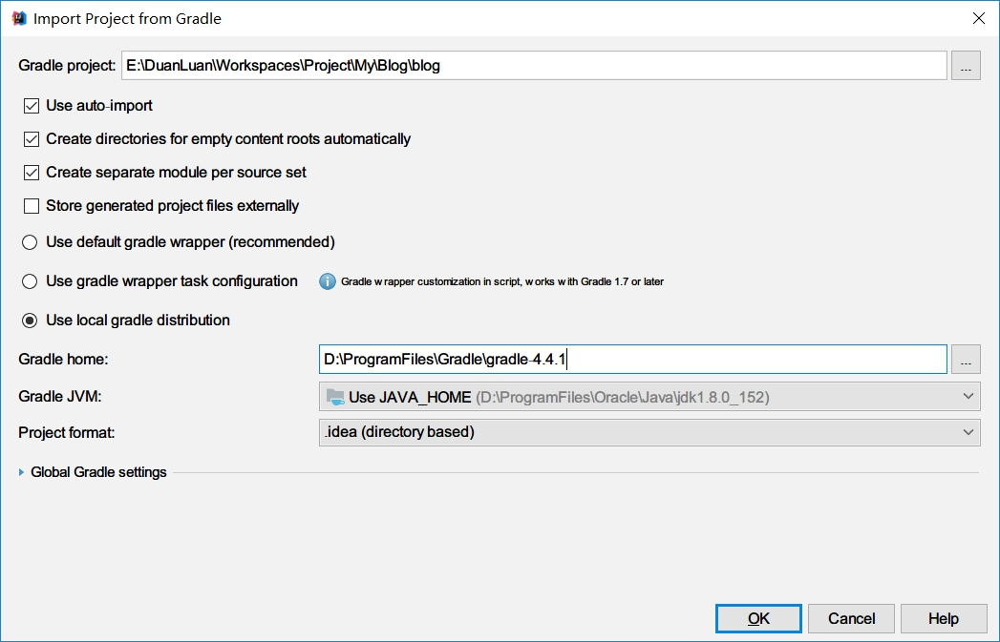
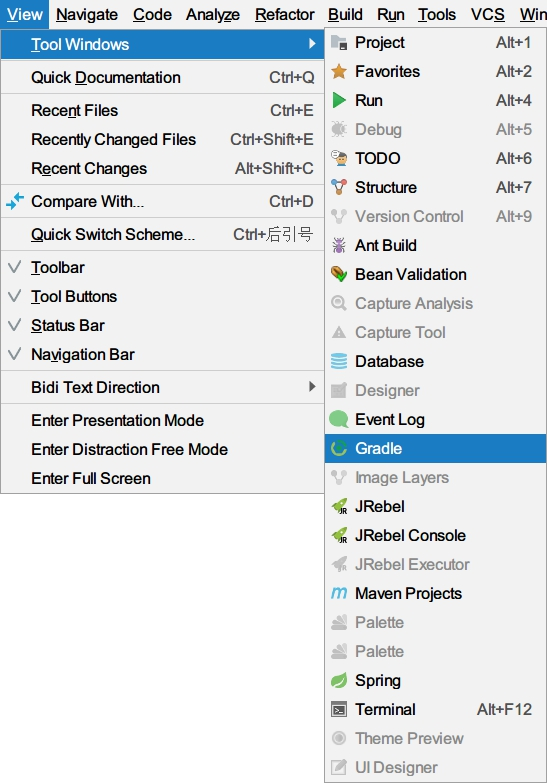
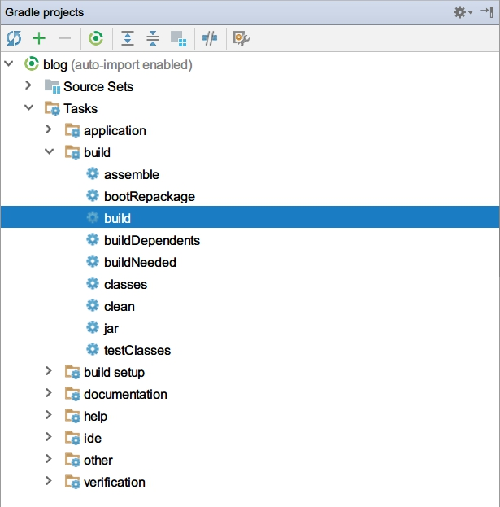
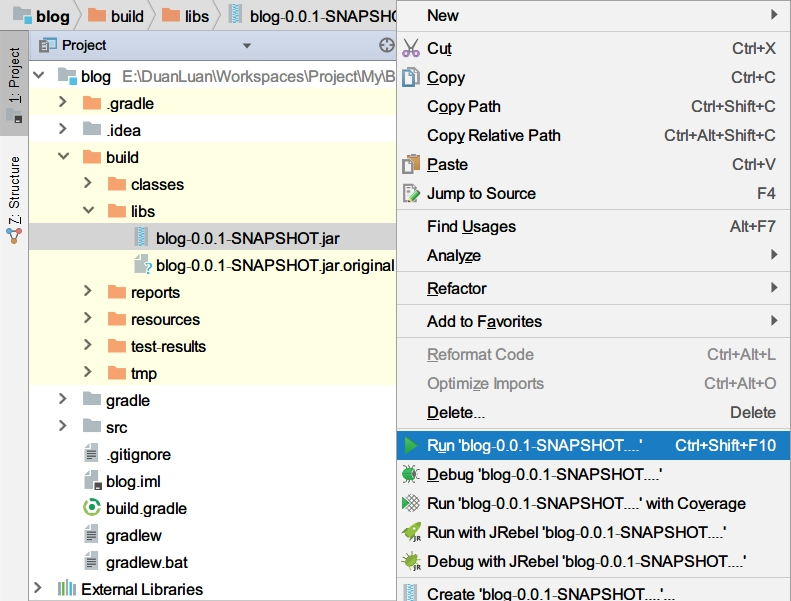
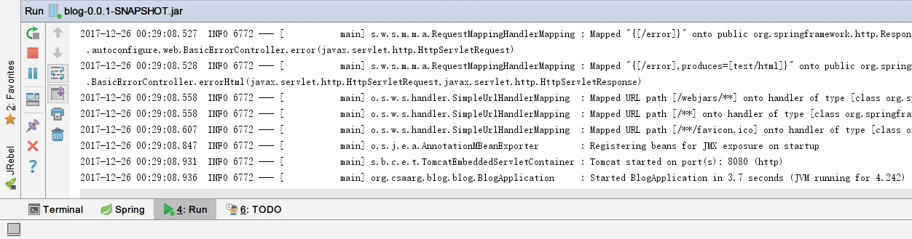
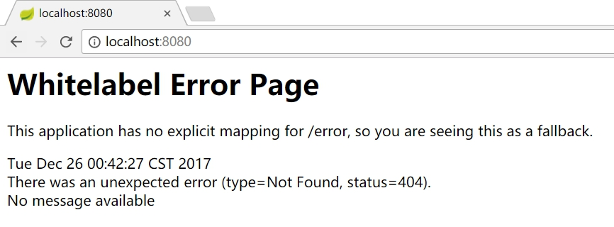

# 创建项目

## 1. 使用 Spring Initializr 初始化 Web 项目

打开 [Spring Initializr](//start.spring.io/)，生成一个 Gradle Project，除了填写 Group 和 Artifact 之外，还需要在 Dependencies 当中添加 Web（Full-stack web development with Tomcat and Spring MVC）：



把下载的项目解压并重命名为 `blog`，IDEA 当中选择 Open 打开项目，在弹出的 Import Project from Gradle 窗口中，勾选 “User auto-import” 和 “Create directories for empty content roots automatically”，选中 “User local gradle distribution”，设置 “Gradle home”，详见 [Import Project from SBT. Page 1 - Help | IntelliJ IDEA](//jetbrains.com/help/idea/import-project-from-sbt-page-1.html)。



最后点击“OK”，等待项目加载。

## 2. Gradle 相关文件

### 2.1 build.gradle

这个文件在根目录下，所有内容解释详见 [Gradle DSL](//docs.gradle.org/current/dsl/)。

```groovy
// 编译脚本，公共配置
buildscript {
    // 额外属性（extra properties），一般用来配置版本号
    ext {
        springBootVersion = '1.5.9.RELEASE'
    }
    // 依赖库
    repositories {
        // Maven 中央仓库
        mavenCentral()
    }
    // 依赖项
    dependencies {
        classpath("org.springframework.boot:spring-boot-gradle-plugin:${springBootVersion}")
    }
}

// 应用插件
apply plugin: 'java'
// 将默认的 “eclipse” 改成 “idea”
apply plugin: 'idea'
apply plugin: 'org.springframework.boot'

group = 'org.csaarg.blog'
version = '0.0.1-SNAPSHOT'
// Java 版本
sourceCompatibility = 1.8

repositories {
    mavenCentral()
}

dependencies {
    // 编译时
    compile('org.springframework.boot:spring-boot-starter-web')
    // 测试编译时
    testCompile('org.springframework.boot:spring-boot-starter-test')
}
```

### 2.2 Gradle Wrapper

执行项目根目录下的 gradlew.bat（Windows） 和 gradlew（Linux），Wrapper 会自动下载并安装对应版本的 Gradle，来保证编译环境统一，Gradle 下载地址配置于 gradle/wrapper/gradle-wrapper.properties 文件中，详见 [The Gradle Wrapper | Gradle User Guide](//docs.gradle.org/current/userguide/gradle_wrapper.html)、[Wrapper | Gradle DSL](//docs.gradle.org/current/dsl/org.gradle.api.tasks.wrapper.Wrapper.html)。

## 3. 使用 Gradle 编译项目

在 IDEA 右侧打开 Gradle 窗口，如果没有的话可以通过菜单栏 -> View -> Tool Windows -> Gradle 开启，然后执行 “build” 任务编译项目。





编译成功后会在项目根目录多出一个 build 文件夹，在 build/libs 下有一个 blog-0.0.1-SNAPSHOT.jar 文件，右键运行。



可以看到运行日志倒数第二行 “Tomcat started on port(s): 8080 (http)”，说明这个 Web 项目运行在了 Tomcat 8080 端口。



打开浏览器访问 [localhost:8080](//localhost:8080)，虽然返回的是错误页面，但这是正常的，代表项目已经成功运行了。


