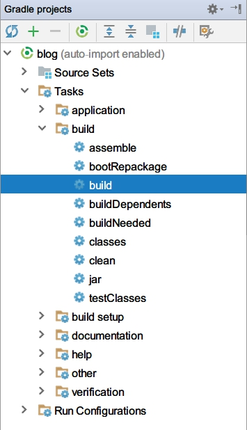

# 创建项目

## 1. 使用 Spring Initializr 初始化 Web 项目

打开 [Spring Initializr](//start.spring.io/) 生成一个 Gradle Project，除了填写 Group 和 Artifact 之外，还需要在 Dependencies 当中添加 Web（Full-stack web development with Tomcat and Spring MVC）：


把下载的项目解压，IDEA 当中选择 “Open” 打开项目，在弹出的 Import Project from Gradle 窗口中，勾选 “User auto-import” 和 “Create directories for empty content roots automatically”，选中 “User local gradle distribution”，设置 “Gradle home”，详见 [Import Project from SBT. Page 1 - Help | IntelliJ IDEA](//jetbrains.com/help/idea/import-project-from-sbt-page-1.html)。


最后点击“OK”，等待项目加载。

## 2. Gradle 相关文件

### 2.1 build.gradle

这个文件在根目录下，所有内容解释详见 [Gradle DSL](//docs.gradle.org/current/dsl/)。

```groovy
// 编译脚本，公共配置
buildscript {
    // 额外属性（extra properties），一般用来配置版本号
    ext {
        springBootVersion = '1.5.9.RELEASE'
    }
    // 依赖库
    repositories {
        // Maven 中央仓库
        mavenCentral()
    }
    // 依赖项
    dependencies {
        classpath("org.springframework.boot:spring-boot-gradle-plugin:${springBootVersion}")
    }
}

// 应用插件
apply plugin: 'java'
// 将默认的 “eclipse” 改成 “idea”
apply plugin: 'idea'
apply plugin: 'org.springframework.boot'

group = 'org.csaarg.blog'
version = '0.0.1-SNAPSHOT'
// Java 版本
sourceCompatibility = 1.8

repositories {
    mavenCentral()
}

dependencies {
    // 编译时
    compile('org.springframework.boot:spring-boot-starter-web')
    // 测试编译时
    testCompile('org.springframework.boot:spring-boot-starter-test')
}
```

### 2.2 Gradle Wrapper

执行项目根目录下的 gradlew.bat（Windows） 和 gradlew（Linux），Wrapper 会自动下载并安装对应版本的 Gradle，来保证编译环境统一，Gradle 下载地址配置于 gradle/wrapper/gradle-wrapper.properties 文件中，详见 [The Gradle Wrapper | Gradle User Guide](//docs.gradle.org/current/userguide/gradle_wrapper.html)、[Wrapper | Gradle DSL](//docs.gradle.org/current/dsl/org.gradle.api.tasks.wrapper.Wrapper.html)。

## 3. 运行项目

### 3.1 Gradle 编译运行

在 IDEA 右侧打开 Gradle 窗口，如果没有的话可以通过菜单栏 -> View -> Tool Windows -> Gradle 开启，然后执行 “build” 任务编译项目，相当于在项目目录命令行执行 `gradle build`，也可以执行 `gradlew build` 命令来编译。




编译成功后会在项目根目录多出一个 build 文件夹，在 build/libs 下有一个 blog-0.0.1-SNAPSHOT.jar 文件，右键运行。


可以看到运行日志倒数第二行 “Tomcat started on port(s): 8080 (http)”，说明这个 Web 项目运行在了 Tomcat 8080 端口。


打开浏览器访问 [localhost:8080](//localhost:8080)，虽然返回的是错误页面，但这是正常的，代表项目已经成功运行了。


### 3.2 Application 类运行

在 src/main/java 当中创建 org.csaarg.blog.controller 包，然后创建 HelloController 类：

> 以后说建测试类或者“在 test 下创建 ……”就是指 src/test/java 下，不说就在 src/main/java 下。

```java
package org.csaarg.blog.controller;

import org.springframework.web.bind.annotation.RequestMapping;
import org.springframework.web.bind.annotation.RestController;

// 相当于 @Controller + @ResponseBody，即这个类中的方法会直接将内容或对象作为 HTTP 响应正文返回，视图解析器无效。
@RestController
public class HelloController {

    @RequestMapping("/hello")
    public String hello() {
        return "Hello, World!";
    }

}

```

然后是 Application 类：

```java
package org.csaarg.blog;

import org.springframework.boot.SpringApplication;
import org.springframework.boot.autoconfigure.SpringBootApplication;

// 相当于 @Configuration + @EnableAutoConfiguration + @ComponentScan
// @Configuration 标注当前类为配置类，并将当前类内标注 @Bean 注解的方法实例注册为 Bean；
// @EnableAutoConfiguration 作用是启用 Spring 应用上下文的自动配置，根据依赖包猜测和配置需要的 Bean；
// @ComponentScan 会自动扫描指定包下所有标有 @Component、@Controller、@Service、@Repository 注解的类并注册为 Bean。
@SpringBootApplication
public class BlogApplication {

    public static void main(String[] args) {
        // 启动 Spring 应用
        SpringApplication.run(BlogApplication.class, args);
    }

}
```

可以在这个类当中按下 Ctrl + Shift + F10 或者右键选择 “Run BlogApplication” 运行项目并访问 [localhost:8080/hello](//localhost:8080/hello) 查看结果。


### 3.3 测试类运行

在 test 下创建对应的 org.csaarg.blog.controller 包和 HelloControllerTest 类：

```java
package org.csaarg.blog.controller;

import org.junit.Test;
import org.junit.runner.RunWith;
import org.springframework.beans.factory.annotation.Autowired;
import org.springframework.boot.test.autoconfigure.web.servlet.AutoConfigureMockMvc;
import org.springframework.boot.test.context.SpringBootTest;
import org.springframework.http.MediaType;
import org.springframework.test.context.junit4.SpringRunner;
import org.springframework.test.web.servlet.MockMvc;
import org.springframework.test.web.servlet.request.MockMvcRequestBuilders;

import static org.hamcrest.core.IsEqual.equalTo;
import static org.springframework.test.web.servlet.result.MockMvcResultMatchers.content;
import static org.springframework.test.web.servlet.result.MockMvcResultMatchers.status;

// 指定 JUnit 的运行器为 SpringRunner（SpringJUnit4ClassRunner 的别名），它会在测试开始时自动创建 Spring 应用上下文，避免手动配置。
@RunWith(SpringRunner.class)
// 使用 SpringBootContextLoader 作为默认的 ContextLoader，因为下面需要用到 MockMvc 类。
@SpringBootTest
// 启用 Mock MVC 的自动配置。
@AutoConfigureMockMvc
public class HelloControllerTest {

    @Autowired
    // Mock MVC 提供了一套完整的 MVC 测试方法。
    private MockMvc mockMvc;

    @Test
    public void testHello() throws Exception {
        // 执行一个 RequestBuilder 请求，会映射到对应的控制器中执行处理，可以对结果进行验证是否正常。
        mockMvc.perform(
                MockMvcRequestBuilders
                        // 以 GET 方式请求指定 URL。
                        .get("/hello")
                        // 创建 Accept Header，代表客户端希望接收的数据类型为 JSON。
                        .accept(MediaType.APPLICATION_JSON))
                // 添加 ResultMatcher 验证规则，验证响应状态码是否为 200（成功）。
                .andExpect(status().isOk())
                // 验证响应正文是否为 “Hello, World!”。
                .andExpect(content().string(equalTo("Hello, World!")));
    }

}
```

运行 HelloControllerTest 类如果没有报错就代表成功了。


